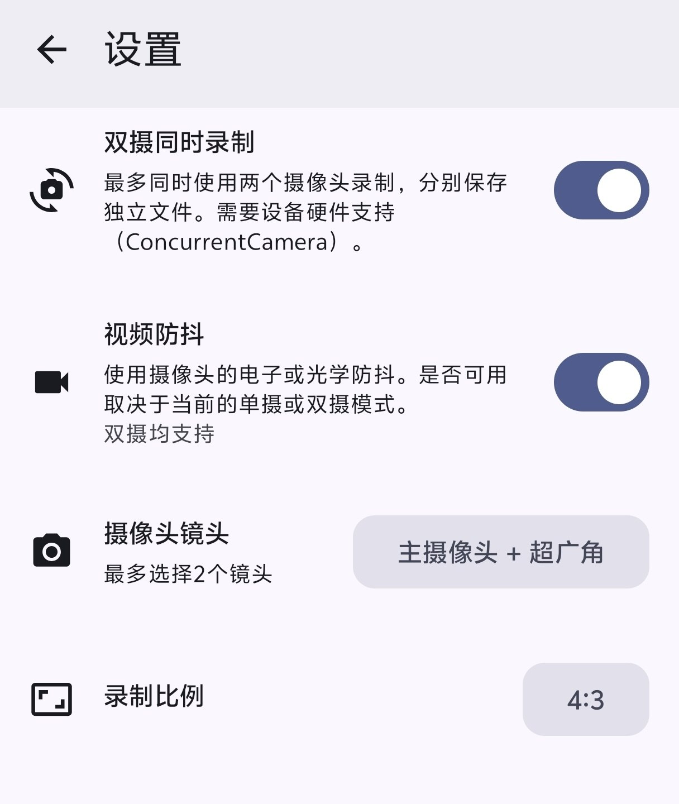

# Alibi-Cam（双摄防抖增强版）

    
    
    
    
    
    

本项目为 [Myzel394/Alibi](https://github.com/Myzel394/Alibi) 的**二次 Fork 增强版**，加入**双摄/防抖/快速录制**定制功能。

> ⚠️ **注意（Protake 包名冲突）**：
> 为启用多摄并发（绕过 vivo/小米等厂商 HAL 限制），本项目包名设为 `com.blink.academy.protake`。若已安装官方 **Protake** 会发生冲突，需先卸载或自行修改 `applicationId` 重新打包。

## 二次 Fork 增强特性（本项目）

- 🎥 **双摄同步录像** — 支持前后或后置双摄同时录制，优化多物理镜头调度（需厂商 HAL 支持）(仅基于Vivo手机测试)
- 🧭 **视频防抖** — 支持原生 OIS 光学防抖与 EIS 配置
- 🚀 **快速录制** — 支持桌面 App Shortcuts 与下拉通知栏磁贴，后台一键直录
- 🔄 **GitHub 检查更新** — 直连 GitHub Releases API 检测最新版本
- 🛡️ **纯净无遥测** — 彻底清理遥测与多余上报

    
    

## 一次 Fork 继承特性（Alibi-Leo）

- 🔧 **修复 FFmpeg 崩溃** — 解决自动停止时丢失最后一分钟视频问题
- ⚡ **默认 24fps** — 相比 30fps 省电约 20%
- 🛑 **姿态感知停止** — 倾角/运动状态感知自动停止录像（含灵敏度调节）
- 🗑️ **永久物理删除** — 绕过系统回收站直接释放空间

## Download / 下载

## 原始版本

## 许可证 / License

本项目基于 [GPL v3](LICENSE) 开源。原作者为 [Myzel394](https://github.com/Myzel394)。
